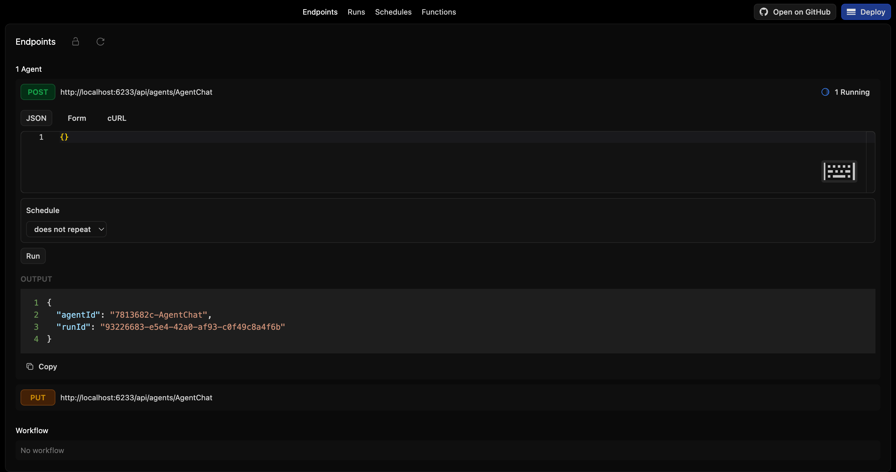
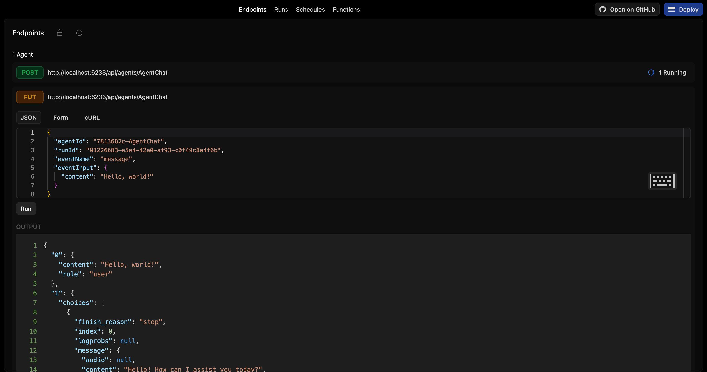
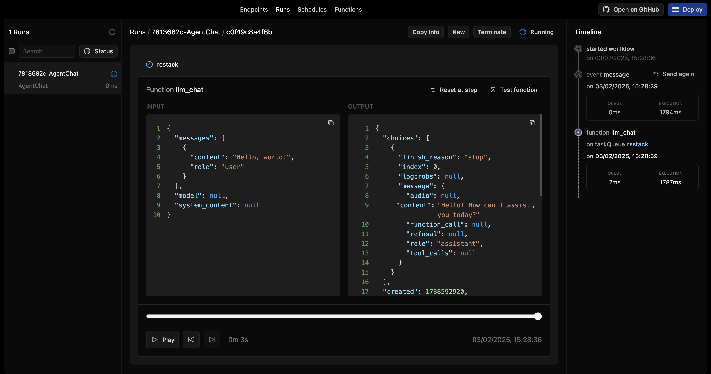

# Restack AI - Agent with chat

This repository contains an agent with chat for Restack.
It demonstrates how to set up a workflow to have a conversation with an AI agent.

## Prerequisites

- Docker (for running Restack)
- Python 3.10 or higher

## Start Restack

To start the Restack, use the following Docker command:

```bash
docker run -d --pull always --name restack -p 5233:5233 -p 6233:6233 -p 7233:7233 -p 9233:9233 ghcr.io/restackio/restack:main
```

## Start python shell

If using uv:

```bash
uv venv && source .venv/bin/activate
```

If using pip:

```bash
python -m venv .venv && source .venv/bin/activate
```

## Install dependencies

If using uv:

```bash
uv sync
uv run dev
```

If using pip:

```bash
pip install -e .
python -c "from src.services import watch_services; watch_services()"
```

## Run agent

### from UI

You can run workflows from the UI by clicking the "Run" button.



### from API

You can run workflows from the API by using the generated endpoint:

`POST http://localhost:6233/api/agents/AgentChat`

### from any client

You can run workflows with any client connected to Restack, for example:

If using uv:

```bash
uv run schedule-seed-workflow
```

If using pip:

```bash
python -c "from src.schedule_workflow import run_schedule_seed_workflow; run_schedule_seed_workflow()"
```

executes `schedule_agent.py` which will connect to Restack and execute the `AgentChat` agent.

## Send events to the Agent

### from UI

You can send events like message or end from the UI.



And see the events in the run:



### from API

You can send events to the agent by using the following endpoint:

`PUT http://localhost:6233/api/agents/AgentChat/:agentId/:runId`

with the payload:

```json
{
  "eventName": "messages",
  "eventInput": {
    "messages": [{"role": "user", "content": "tell me a joke"}]
  }
}
```

to send messages to the agent.

or

```json
{
  "eventName": "end"
}
```

to end the conversation with the agent.

### from any client

You can send event to the agent workflows with any client connected to Restack, for example:

Modify workflow_id and run_id in event_workflow.py and then run:

If using uv:

```bash
uv run event
```

If using pip:

```bash
python -c "from src.event_agent import run_event_agent; run_event_agent()"
```

It will connect to Restack and send 2 events to the agent, one to generate another agent and another one to end the conversation.

## Deploy on Restack Cloud

To deploy the application on Restack, you can create an account at [https://console.restack.io](https://console.restack.io)
