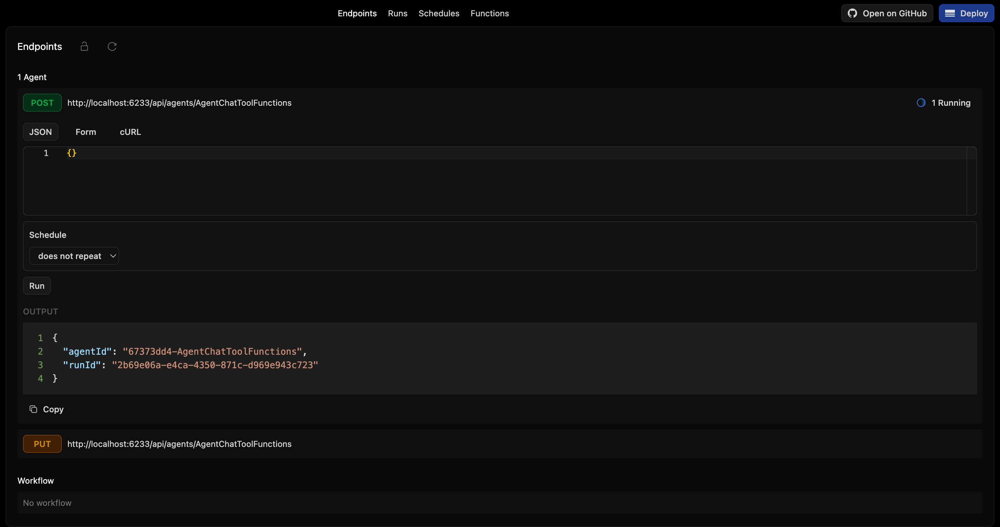
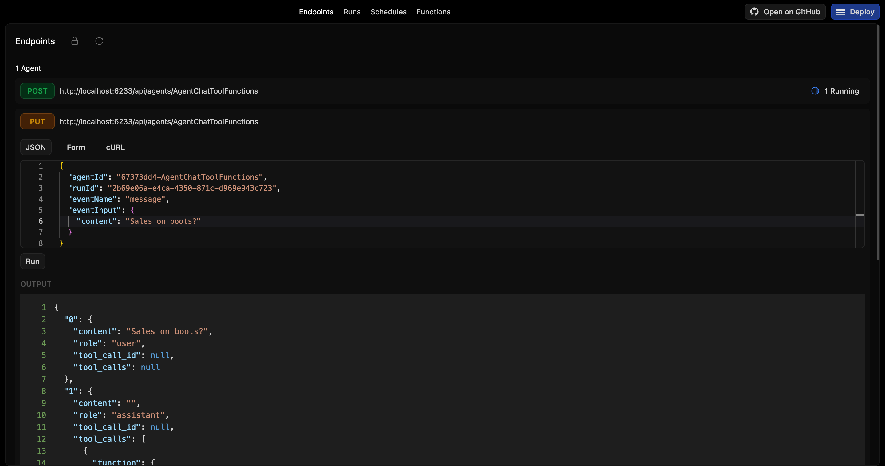
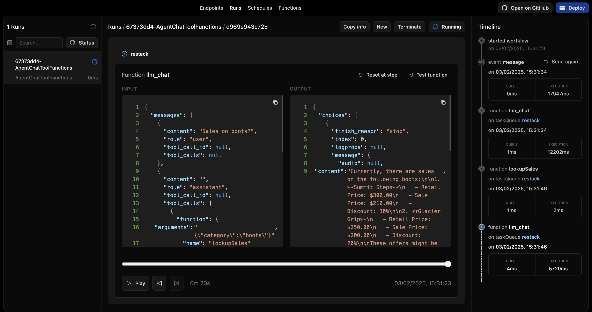
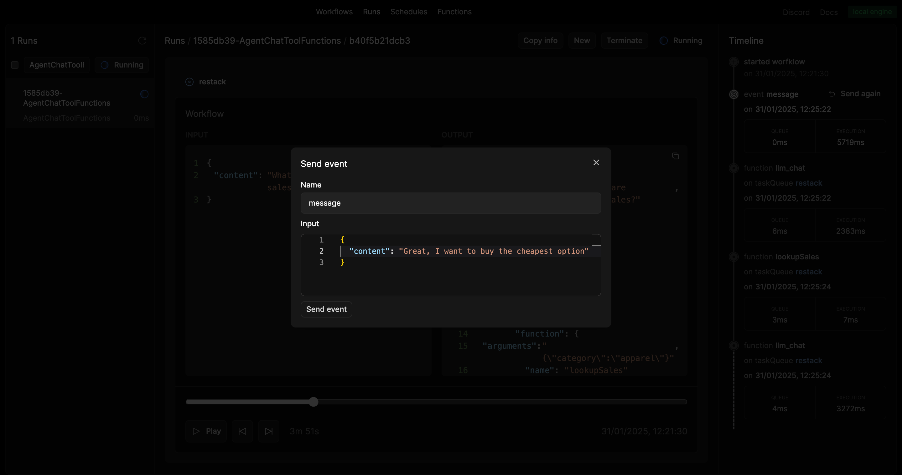

# Restack AI - Agent with RAG

This repository demonstrates how to set up a basic agent with RAG.

Follow [the step-by-step tutorial](https://docs.restack.io/examples/projects/agent#tutorial) on how to customize the agent tool example/

## Prerequisites

- Docker (for running Restack)
- Python 3.10 or higher

## Start Restack

To start the Restack, use the following Docker command:

```bash
docker run -d --pull always --name restack -p 5233:5233 -p 6233:6233 -p 7233:7233 -p 9233:9233 ghcr.io/restackio/restack:main
```

## Start python shell

If using uv:

```bash
uv venv && source .venv/bin/activate
```

If using pip:

```bash
python -m venv .venv && source .venv/bin/activate
```

## Install dependencies

If using uv:

```bash
uv sync
uv run dev
```

If using pip:

```bash
pip install -e .
python -c "from src.services import watch_services; watch_services()"
```

## Configure Your Environment Variables

Duplicate the `env.example` file and rename it to `.env`.

Obtain a Restack API Key to interact with the 'gpt-4.1-mini' model at no cost from [console.restack.io](https://console.restack.io)

## Run agents

### from UI

You can run agents from the UI by clicking the "Run" button.



### from API

You can run agents from the API by using the generated endpoint:

`POST http://localhost:6233/api/agents/AgentRag`

## Send an event to the agent

### from UI

```
{
  "agentId": "{agent_id}",
  "runId": "{run_id}",
  "eventName": "messages",
  "eventInput": {
    "messages": [{"role": "user", "content": "What clothes are currently on sale?"}]
  }
}
```



You can send events to the agent by using the generated endpoint:

`PUT http://localhost:6233/api/agents/AgentRag/:agentId/:runId`

and the payload:

```
{
  "eventName": "messages",
  "eventInput": {
    "messages": [{"role": "user", "content": "What clothes are currently on sale?"}]
  }
}
```

## See the agent run

You cna replay and follow the agent run in the UI.



Now, you can simply trigger more events from the Developer UI by clicking in the timeline on 'Send again' for the event and change the payload.



## Deploy on Restack Cloud

To deploy the application on Restack, you can create an account at [https://console.restack.io](https://console.restack.io)
