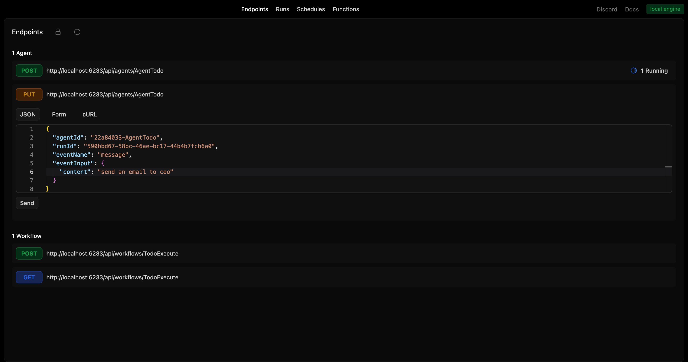
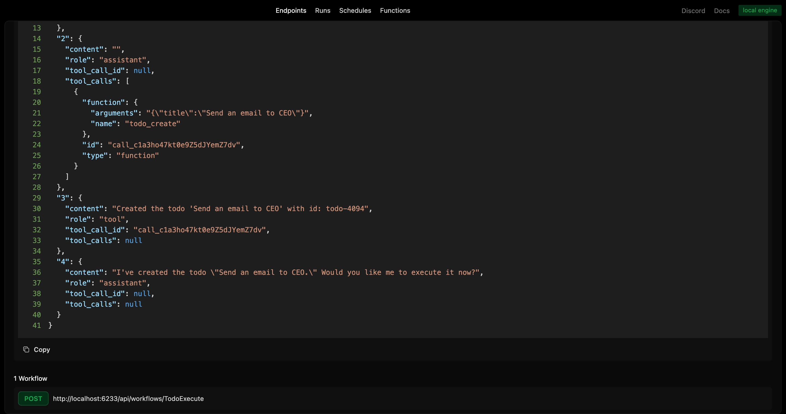
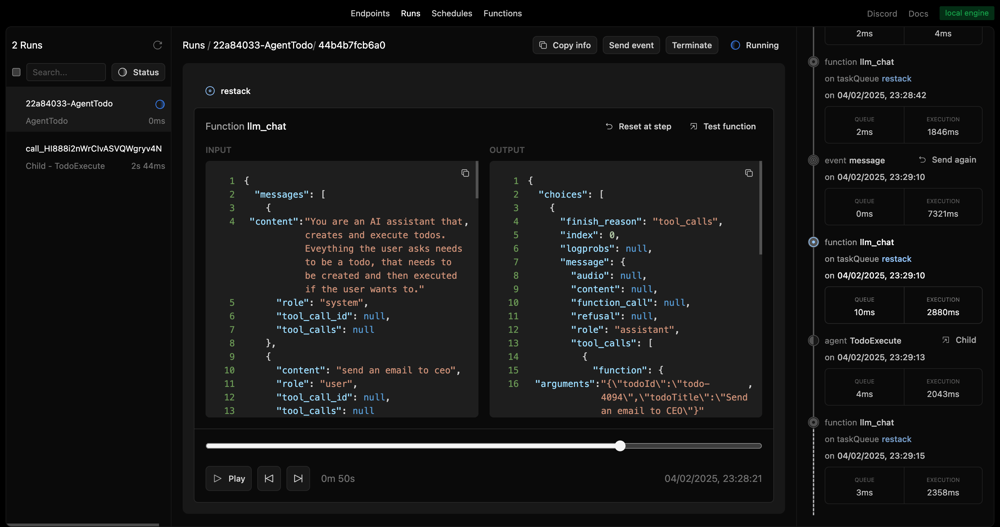
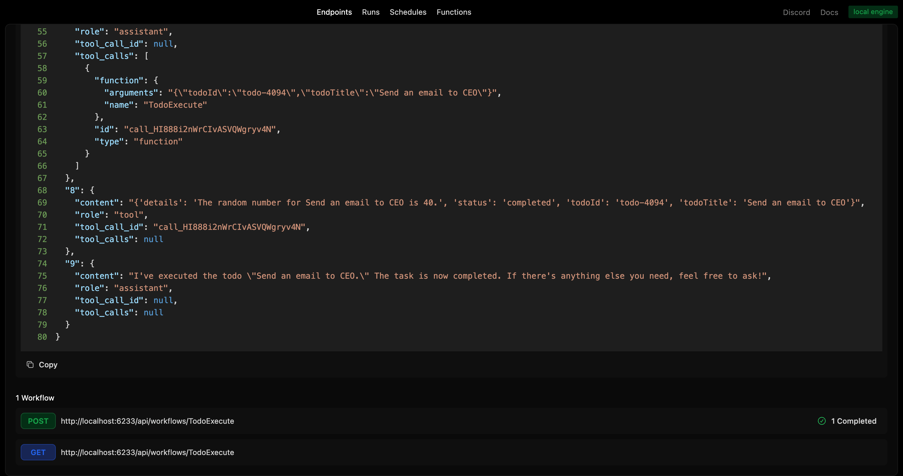
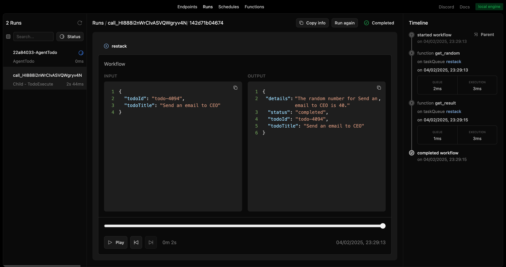

# Restack AI - Agent with todo list

This repository contains an agent with todo list for Restack.
It demonstrates how to set up a basic agent with tool call with a basic workflow and functions.

## Prerequisites

- Docker (for running Restack)
- Python 3.10 or higher

## Start Restack

To start the Restack, use the following Docker command:

```bash
docker run -d --pull always --name restack -p 5233:5233 -p 6233:6233 -p 7233:7233 -p 9233:9233 ghcr.io/restackio/restack:main
```

## Start python shell

If using uv:

```bash
uv venv && source .venv/bin/activate
```

If using pip:

```bash
python -m venv .venv && source .venv/bin/activate
```

## Install dependencies

If using uv:

```bash
uv sync
uv run dev
```

If using pip:

```bash
pip install -e .
python -c "from src.services import watch_services; watch_services()"
```

## Run agents

### from UI

You can run agents from the UI by clicking the "Run" button.



### from API

You can run agents from the API by using the generated endpoint:

`POST http://localhost:6233/api/agents/AgentTodo`

### from any client

You can run agents with any client connected to Restack, for example:

If using uv:

```bash
uv run schedule
```

If using pip:

```bash
python -c "from schedule import run_schedule; run_schedule()"
```

executes `schedule.py` which will connect to Restack and execute the `AgentTodo` agent.

## Send an event to the agent

In our example we will ask the AI agent to create a todo.

### from UI

```
{
  "agentId": "{agent_id}",
  "runId": "{run_id}",
  "eventName": "messages",
  "eventInput": {
    "messages": [{"role": "user", "content": "Can you send an email to the CEO?"}]
  }
}
```



You can send events to the agent by using the generated endpoint:

`PUT http://localhost:6233/api/agents/AgentTodo/:agentId/:runId`

and the payload:

```
{
  "eventName": "messages",
  "eventInput": {
    "messages": [{"role": "user", "content": "Can you send an email to the CEO?"}]
  }
}
```

## See the agent run

The LLM will use tool call to create the todo.
The creation of the todo will be done in a simple function.

You can replay and follow the agent run in the UI.



Now, you can simply trigger more events from the Developer UI.

In this case, the agent will ask permission to execute the todo.



If confirmed, this time the agent will execute the todo in a 2-step workflow.



## Deploy on Restack Cloud

To deploy the application on Restack, you can create an account at [https://console.restack.io](https://console.restack.io)
