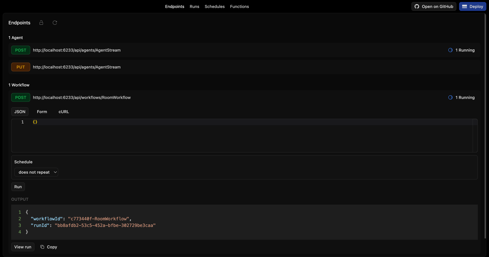
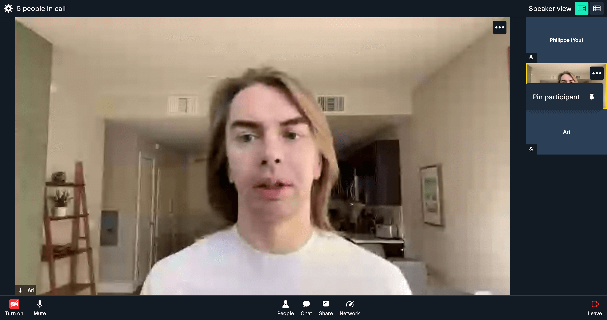
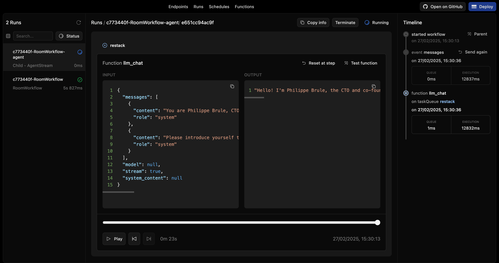

# Restack AI - Agent with video

Build an AI agent that users can interact with in realtime on a video call.

This readme explains how to run this example.
For a complete documentation on how the agent works and how to setup the services, visit https://docs.restack.io/telephony-video-voice/video

## Prerequisites

- Docker (for running Restack)
- Python 3.10 or higher
- Deepgram account (For speech-to-text transcription)
- Cartesia account (for text-to-speech and voice cloning)
- Tavus account (for video replica)

## Start Restack

To start the Restack, use the following Docker command:

```bash
docker run -d --pull always --name restack -p 5233:5233 -p 6233:6233 -p 7233:7233 -p 9233:9233 ghcr.io/restackio/restack:main
```

## Start python shell

If using uv:

```bash
uv venv && source .venv/bin/activate
```

If using pip:

```bash
python -m venv .venv && source .venv/bin/activate
```

## Install dependencies

If using uv:

```bash
uv sync
uv run dev
```

If using pip:

```bash
pip install -e .
python -c "from src.services import watch_services; watch_services()"
```

## Configure Your Environment Variables

Duplicate the `env.example` file and rename it to `.env`.

Obtain a Restack API Key to interact with the 'gpt-4.1-mini' model at no cost from [Restack Cloud](https://console.restack.io/starter)

## Create Room and run Agent in parallel

### from UI

Create the room and run the agent from the UI by clicking the "Run" button for the workflow "RoomWorkflow".



### from API

Create the room and run the agent from the API by using the generated endpoint:

`POST http://localhost:6233/api/workflows/RoomWorkflow`

## Join the video call

You can join the video call by using the room url returned by RoomWorkflow.
You should be able to speak to your replica



## Follow the agent run

You can replay and follow the agent run in the UI.



## Deploy on Restack Cloud

To deploy the application on Restack, you can create an account at [https://console.restack.io](https://console.restack.io)
