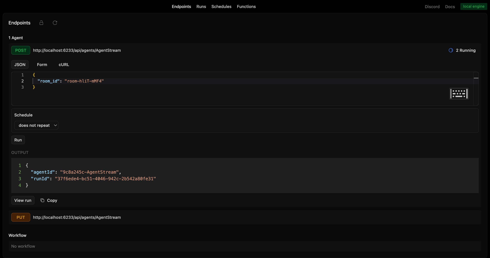
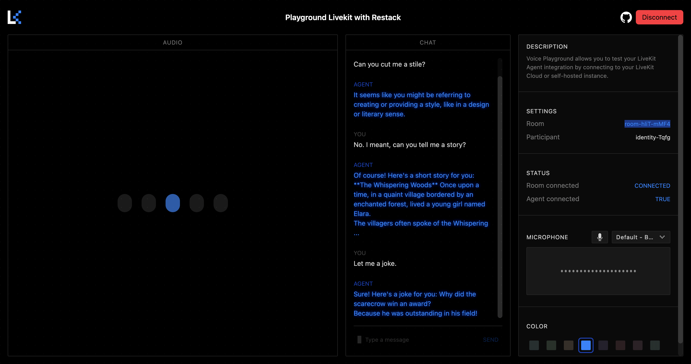
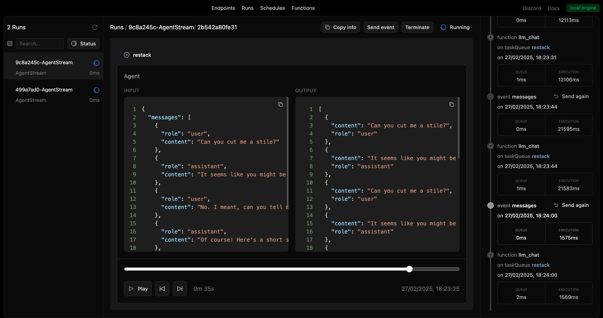

# Restack AI - Agent with voice

Build an AI agent that users can interact with in realtime with voice.

This readme explains how to run this example.
For a complete documentation on how the agent works and how to setup the services, visit https://docs.restack.io/telephony-video-voice/voice

## Prerequisites

- Docker (for running Restack)
- Python 3.10 or higher
- Livekit account (for live chat)
- Deepgram account (For speech-to-text transcription)
- ElevenLabs account (for text-to-speech and voice cloning)

## Configure environment variables

In all subfolders, duplicate the `env.example` file and rename it to `.env`.

### How to setup

1. **Set up Deepgram**
  - Sign up at [Deepgram](https://developers.deepgram.com/home/introduction)
  - Get an API key

2. **Set up Livekit**
  - Sign up at [Livekit](https://docs.livekit.io/home/)
  - In .env file:
    - Set `LIVEKIT_URL` to `WEBSOCKET_URL` value
    - Set `LIVEKIT_API_KEY` to `API_KEY` value
    - Set `LIVEKIT_API_SECRET` to `API_SECRET` value

3. **Set up ElevenLabs**
  - Sign up at [ElevenLabs](https://elevenlabs.io/docs/overview)
  - Add `ELEVENLABS_API_KEY` to .env file

Obtain a Restack API Key to interact with the 'gpt-4.1-mini' model at no cost from [Restack Cloud](https://console.restack.io/starter)

## Start Restack

To start the Restack, use the following Docker command:

```bash
docker run -d --pull always --name restack -p 5233:5233 -p 6233:6233 -p 7233:7233 -p 9233:9233 ghcr.io/restackio/restack:main
```

## Start Restack Agent with Voice

### Start python shell

If using uv:

```bash
uv venv && source .venv/bin/activate
```

If using pip:

```bash
python -m venv .venv && source .venv/bin/activate
```

### Install dependencies

If using uv:

```bash
uv sync
uv run dev
```

If using pip:

```bash
pip install -e .
python -c "from src.services import watch_services; watch_services()"
```

## Start Livekit voice pipeline

### Start python shell

If using uv:

```bash
uv venv && source .venv/bin/activate
```

If using pip:

```bash
python -m venv .venv && source .venv/bin/activate
```

### Install dependencies

If using uv:

```bash
uv sync
uv run python src/pipeline.py dev
```

If using pip:

```bash
pip install -e .
python src/pipeline.py dev
```

## Interact in realtime with the agent

Run the Livekit Agents Playground:

https://github.com/livekit/agents-playground

Modify your .env in https://github.com/livekit/agents-playground/blob/main/.env.example

Run the following commands:
```bash
npm run install
```

```bash
npm run dev
```

Open the Livekit Agents Playground:

http://localhost:3000/

Connect and copy the **room_id**

Open Restack Engine:

http://localhost:5233/

Create a new agent with room_id from Livekit Agents Playground.

## Create a new Agent

### from UI

Run the agent from the UI by clicking the "Run" button for the agent "AgentStream".



### from API

Run the agent from the API by using the generated endpoint:

`POST http://localhost:6233/api/agents/AgentStream`

with input:

```json
{
  "room_id": "your_room_id"
}
```

## Talk to the agent

The Livekit pipleine worker will connect to the room and you can start talking to the agent.




## Follow the agent run

You can replay and follow the agent run in the UI.



## Deploy on Restack Cloud

To deploy the application on Restack, you can create an account at [https://console.restack.io](https://console.restack.io)
