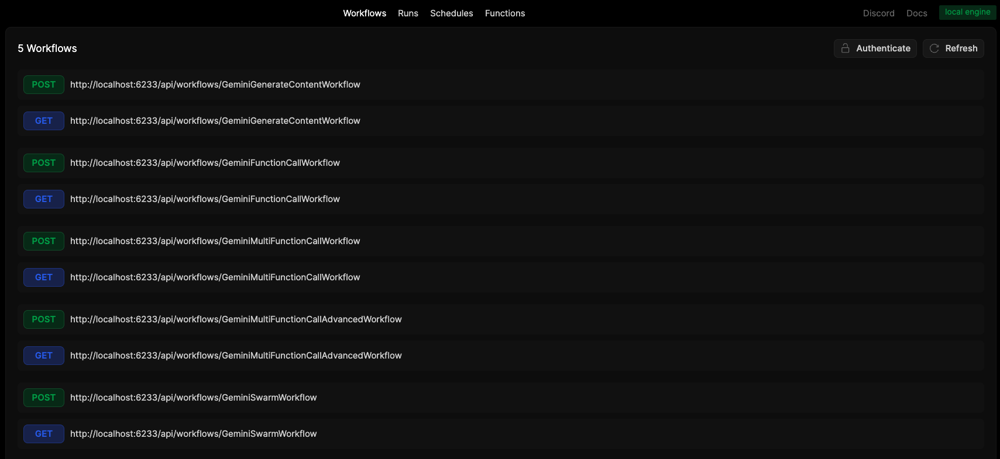
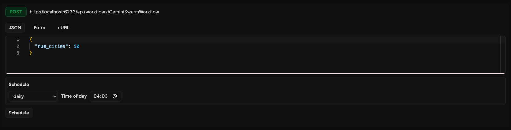

# Restack AI - Gemini Example for Autonomous Agents

This example demonstrates how to build reliable and scalable autonomous AI agents using Google's Gemini API with Restack. It shows how to handle rate limits (10 requests per minute for free tier with 1500 requests per day limit, concurrency limit), concurrent API calls, and workflow orchestration effectively to create agents that can independently perform complex tasks.

Example workflows in `src/workflows/`:

- [Content Generation](src/workflows/generate_content.py): Basic natural language understanding
- [Function Calling](src/workflows/function_call.py): Toolexecution
- [Multi-Function Calling](src/workflows/multi_function_call.py): Complex decision making
- [Multi-Function Calling](src/workflows/multi_function_call_advanced.py): Complex decision making with tools, executed as restack functions (e.g. third party APIs)
- [Swarm](src/workflows/swarm.py): Parallel execution of multiple coordinated agents

## Motivation

When building AI applications with Gemini, you need to handle various production challenges:

1. **API Rate Limits**: Gemini API has concurrent request limits that need to be managed across multiple workflows.

2. **Reliability**: AI workflows need retry mechanisms and graceful failure handling for production use.

3. **Scalability**: As your application grows to handle thousands of concurrent agents or requests, you need robust queue management and execution control.

4. **Scheduling**: Coordinating and managing multiple workflows running at different frequencies requires robust scheduling capabilities.

### How Restack Helps

Restack provides built-in solutions for these challenges:

1. **Automated Rate Limiting**: Define rate limits in service options and let Restack handle the queuing:

```python
client.start_service(
    task_queue="gemini",
    functions=[generate_content, function_call],
    options=ServiceOptions(
        rate_limit=3,  # Match Gemini's concurrent call limit
        max_concurrent_function_runs=3
    )
)
```

2. **Built-in Retries**: Restack automatically handles retries and failure scenarios.

3. **Queue Management**: Efficiently manages thousands of concurrent workflows while respecting API limits.

4. **Scheduling**: Run workflows on various schedules (minutely, hourly, daily) or with custom cron expressions.

## Prerequisites

- Python 3.9 or higher
- Uv (for dependency management)
- Docker (for running the Restack services)
- Active [Google AI Studio](https://aistudio.google.com) account with API key

## Set `GEMINI_API_KEY` as an environment variable from [Google AI Studio](https://aistudio.google.com)

```bash
export GEMINI_API_KEY=<your-api-key>
```

## Start Restack

To start the Restack, use the following Docker command:

```bash
docker run -d --pull always --name restack -p 5233:5233 -p 6233:6233 -p 7233:7233 -p 9233:9233 ghcr.io/restackio/restack:main
```

## Start python shell

If using uv:

```bash
uv venv && source .venv/bin/activate
```

If using pip:

```bash
python -m venv .venv && source .venv/bin/activate
```

## Install dependencies

If using uv:

```bash
uv sync
uv run dev
```

If using pip:

```bash
pip install -e .
python -c "from src.services import watch_services; watch_services()"
```

## Schedule workflows via the UI

All workflows are auto-exposed with an RestAPI endpoint, ready to be run or scheduled via api request, or directly from the UI during development.



Run or schedule individual workflows.


Run or schedule a workflow, triggering many agents as childworkflows.



## Project Structure

- `src/`: Main source code directory
  - `client.py`: Initializes the Restack client
  - `functions/`: Contains function definitions
  - `workflows/`: Contains workflow definitions
  - `services.py`: Sets up and runs the Restack services
- `schedule_workflow.py`: Example script to schedule and run a workflow
