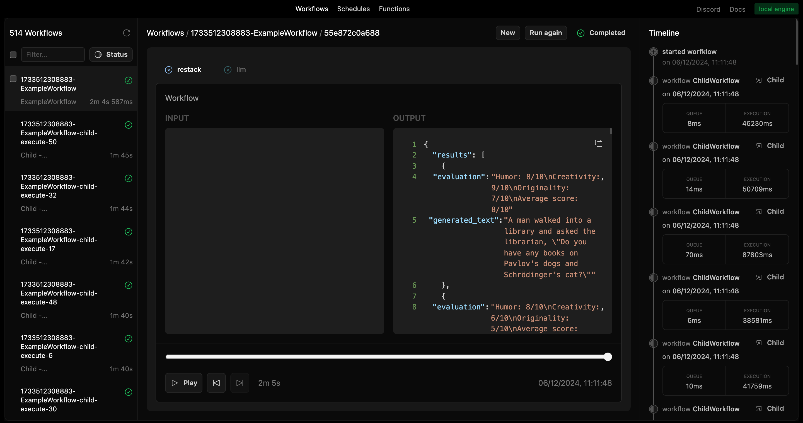
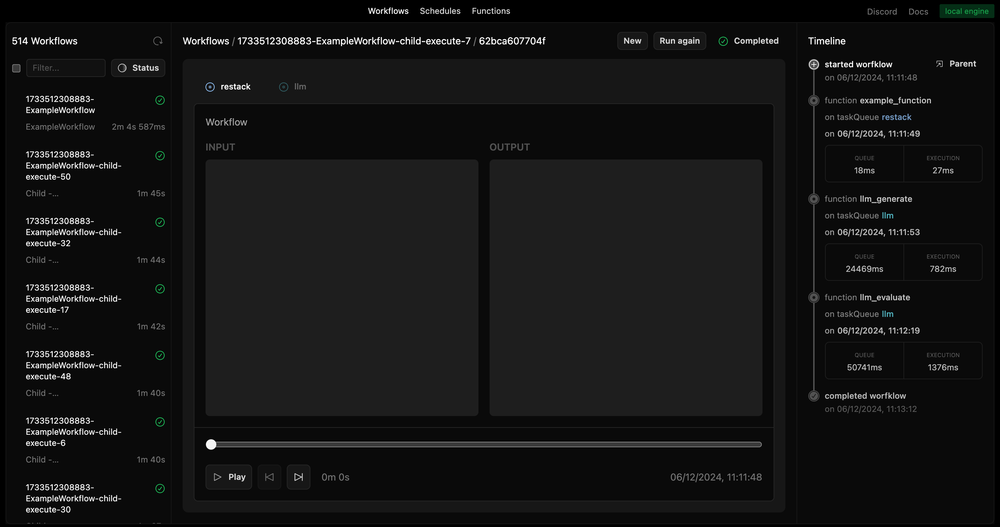
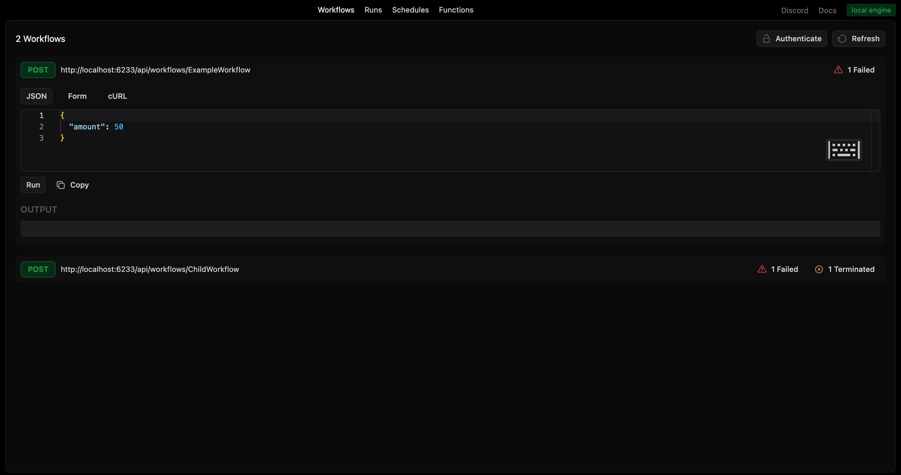

# Restack AI - Production Example

This repository contains a simple example project to help you scale with Restack AI.
It demonstrates how to scale reliably to millions of workflows on a local machine with a local LLM provider.

## Walkthrough video

https://www.youtube.com/watch?v=WsUtQYC74og

## Motivation

When scaling AI workflows, you want to make sure that you can handle failures and retries gracefully.
This example demonstrates how to do this with Restack AI.

### Workflow Steps

The table below shows the execution of 50 workflows in parallel, each with three steps.
Steps 2 and 3 are LLM functions that must adhere to a rate limit of 1 concurrent call per second.

| Step | Workflow 1 | Workflow 2 | ... | Workflow 50 |
| ---- | ---------- | ---------- | --- | ----------- |
| 1    | Basic      | Basic      | ... | Basic       |
| 2    | LLM        | LLM        | ... | LLM         |
| 3    | LLM        | LLM        | ... | LLM         |

### Traditional Rate Limit Management

When running multiple workflows in parallel, managing the rate limit for LLM functions is crucial. Here are common strategies:

1. **Task Queue**: Use a task queue (e.g., Celery, RabbitMQ) to schedule LLM calls, ensuring only one is processed at a time.
2. **Rate Limiting Middleware**: Implement middleware to queue requests and process them at the allowed rate.
3. **Semaphore or Locking**: Use a semaphore or lock to control access, ensuring only one LLM function runs per second.

### With Restack

Restack automates rate limit management, eliminating the need for manual strategies. Define the rate limit in the service options, and Restack handles queuing and execution:

```python
client.start_service(
    task_queue="llm",
    functions=[llm_generate, llm_evaluate],
    options=ServiceOptions(
        rate_limit=1,
        max_concurrent_function_runs=1
    )
)
```

Focus on building your logics while Restack ensures efficient and resilient workflow execution.

### On Restack UI

You can see from the parent workflow how long each child workflow stayed in queue and how long was the execution time.



And for each child workflow, for each step you can see how long the function stayed in queue, how long the function took to execute and how many retries happened.



## Prerequisites

- Python 3.10 or higher
- Uv (for dependency management)
- Docker (for running the Restack services)
- Local LLM provider (we use LMStudio and a Meta Llama 3.2 3B Instruct 4bit model in this example)

## Start LM stduio for local LLM provider

Start local server with an open source model like llama-3.2-3b-instruct

https://lmstudio.ai

## Prerequisites

- Docker (for running Restack)
- Python 3.10 or higher

## Start Restack

To start the Restack, use the following Docker command:

```bash
docker run -d --pull always --name restack -p 5233:5233 -p 6233:6233 -p 7233:7233 -p 9233:9233 ghcr.io/restackio/restack:main
```

## Start python shell

If using uv:

```bash
uv venv && source .venv/bin/activate
```

If using pip:

```bash
python -m venv .venv && source .venv/bin/activate
```

## Install dependencies

If using uv:

```bash
uv sync
uv run dev
```

If using pip:

```bash
pip install -e .
python -c "from src.services import watch_services; watch_services()"
```

## Run workflows

### from UI

You can run workflows from the UI by clicking the "Run" button.



### from API

You can run one workflow from the API by using the generated endpoint:

`POST http://localhost:6233/api/workflows/ChildWorkflow`

or multiple workflows by using the generated endpoint:

`POST http://localhost:6233/api/workflows/ExampleWorkflow`

### from any client

You can run workflows with any client connected to Restack, for example:

If using uv:

```bash
uv run schedule
```

If using pip:

```bash
python -c "from schedule_workflow import run_schedule_workflow; run_schedule_workflow()"
```

executes `schedule_workflow.py` which will connect to Restack and execute the `ChildWorkflow` workflow.

If using uv:

```bash
uv run scale
```

If using pip:

```bash
python -c "from src.schedule_scale import run_schedule_scale; run_schedule_scale()"
```

executes `schedule_scale.py` which will connect to Restack and execute the `ExampleWorkflow` workflow.

If using uv:

```bash
uv run interval
```

If using pip:

```bash
python -c "from src.schedule_interval import run_schedule_interval; run_schedule_interval()"
```

executes `schedule_interval.py` which will connect to Restack and execute the `ChildWorkflow` workflow every second.

## Deploy on Restack Cloud

To deploy the application on Restack, you can create an account at [https://console.restack.io](https://console.restack.io)

## Project Structure

- `src/`: Main source code directory
  - `client.py`: Initializes the Restack client
  - `functions/`: Contains function definitions
  - `workflows/`: Contains workflow definitions
  - `services.py`: Sets up and runs the Restack services
- `schedule_workflow.py`: Example script to schedule and run a workflow
- `schedule_interval.py`: Example script to schedule and a workflow every second
- `schedule_scale.py`: Example script to schedule and run 50 workflows at once

# Deployment

Create an account on [Restack Cloud](https://console.restack.io) and follow instructions on site to create a stack and deploy your application on Restack Cloud.
